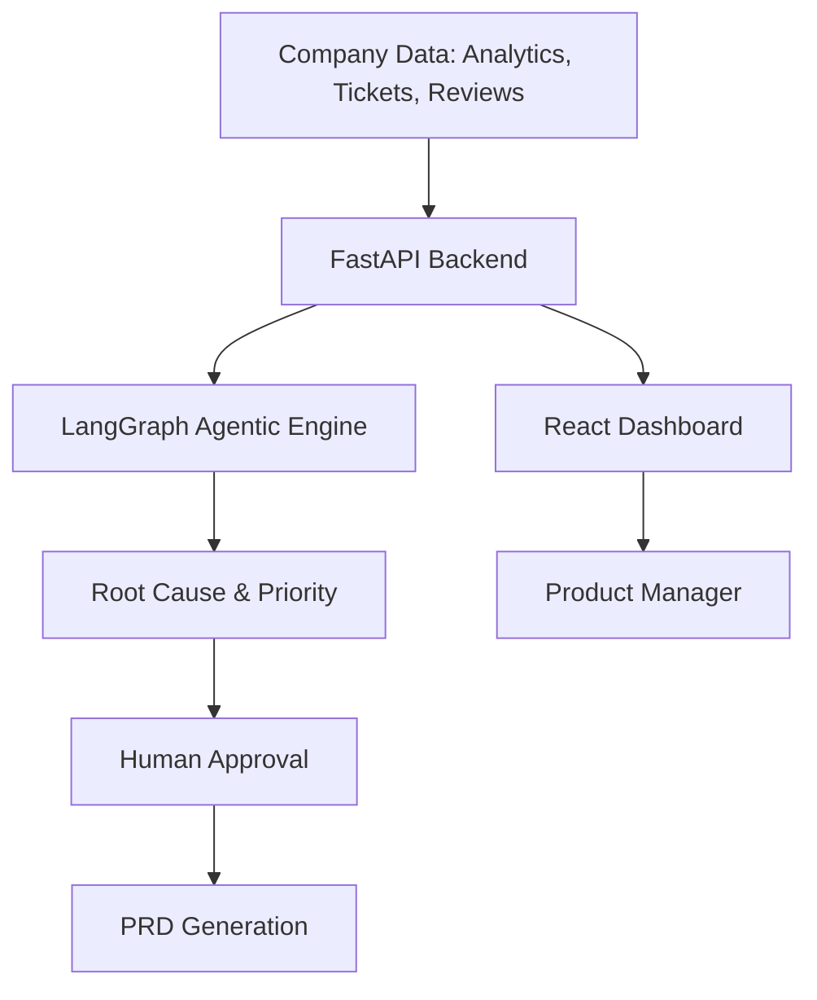

# ProductLens AI
From Customer Signals to Product Decisions

ProductLens AI is an agentic product-intelligence platform that combines product analytics, customer feedback, experimentation and GenAI to help product teams investigate KPI changes, identify root causes, prioritize features and turn evidence into product decisions.

## 🚀 The Demo Story
Experience the power of agentic product intelligence through this connected workflow:
1. **Anomaly Detection**: The system detects a sudden drop in checkout conversion.
2. **Segment Analysis**: Analytics identifies mobile users as the primary affected group.
3. **VOC Intelligence**: Voice of Customer analysis reveals a spike in "Payment page freezing" complaints.
4. **AI Investigation**: The AI Analyst correlates the conversion drop, payment failures, and VOC signals.
5. **Root Cause**: Identified as **Mobile payment-flow instability**.
6. **Recommendation**: System recommends "Implement Payment Retry Logic".
7. **Prioritization**: RICE scoring ranks this as a High Priority feature.
8. **Business Case**: ROI engine estimates the financial impact of the fix.
9. **Human-in-the-Loop**: Product Manager approves the recommendation.
10. **PRD Generation**: AI generates a full Product Requirements Document for the engineering team.
11. **Validation**: A/B experiment results validate the proposed change.

## ✨ Core Features
- **Executive Dashboard**: High-level view of MAU, DAU, Revenue, and Conversion.
- **AI Product Analyst**: Natural language investigation of product signals.
- **Voice of Customer**: Sentiment analysis and topic clustering from tickets and reviews.
- **Anomaly Detection**: Rolling Z-score based KPI monitoring.
- **RICE/ICE Prioritization**: Objective feature ranking based on Reach, Impact, Confidence, and Effort.
- **Business Impact/ROI**: Financial estimation of feature benefits and payback periods.
- **A/B Experimentation**: Statistical validation (p-values, lift) of product hypotheses.
- **Agentic PM Workflow**: Specialized AI agents (Analytics, Customer, Market, Strategy, PRD) coordinating in a graph.
- **Human-in-the-Loop Governance**: Approval/Rejection workflow for AI recommendations.
- **AI PRD Generator**: Automated technical specification generation from approved ideas.
- **Product Design**: Persona mapping and user journey visualization.

## 🏗 Architecture


## 🤖 Agent Workflow
The system utilizes a specialized agent graph to ensure rigorous analysis:
**Analytics Agent** $\rightarrow$ **Customer Agent** $\rightarrow$ **Market Agent** $\rightarrow$ **Strategy Agent** $\rightarrow$ **PRD Agent**

*Demo Mode is deterministic and requires no paid API keys.*

## 🛠 Technology Stack
- **Frontend**: React, TypeScript, Vite, Tailwind CSS, TanStack Query, Recharts
- **Backend**: Python 3.12, FastAPI, SQLAlchemy, LangGraph, LangChain
- **Analytics**: NumPy, SciPy, Scikit-learn, Pandas
- **Database**: PostgreSQL (with pgvector support)
- **Infrastructure**: Docker, Render, GitHub Actions

## 📂 Repository Structure
- `frontend/`: React application
- `backend/`: FastAPI server and AI agents
- `tests/`: Backend API and logic tests
- `render.yaml`: Infrastructure as Code for Render
- `docker-compose.yml`: Local orchestration

## 💻 Local Installation

### Backend
```bash
cd backend
python -m venv .venv
# Windows:
.venv\Scripts\activate
# macOS/Linux:
source .venv/bin/activate
pip install -r requirements.txt
# Optional: seed data
python -c "from app.core.db import SessionLocal; from app.analytics.seed import generate_synthetic_data; generate_synthetic_data(SessionLocal())"
uvicorn app.main:app --reload
```

### Frontend
```bash
cd frontend
npm install
npm run dev
```

## ⚙️ Environment Variables
Copy `.env.example` to `.env` and fill in:
- `DATABASE_URL`: PostgreSQL connection string
- `AI_PROVIDER`: `demo` (no key needed), `openai`, or `ollama`
- `VITE_API_URL`: Backend API URL

## 🐳 Docker
```bash
docker compose up --build
```

## 🧪 Testing
```bash
cd backend
.venv\Scripts\activate
python -m pytest tests/test_api.py
```

## 📜 AI Governance
To prevent "AI hallucinations" from driving product strategy, ProductLens AI implements a strict **Human-in-the-Loop** gate. Every AI-generated recommendation must be manually:
- **Approved**: Moves to PRD generation.
- **Rejected**: Archived as a non-viable idea.
- **Investigated Further**: Sent back to the AI analyst for deeper evidence gathering.

## 🚀 Deployment
Deployed via Render Blueprint (`render.yaml`) using:
- **Web Service**: FastAPI backend
- **Static Site**: React frontend
- **Managed DB**: PostgreSQL

## 🖼 Screenshots
*(Placeholders for dashboard, AI Analyst, and PRD screens)*

## 🔮 Future Improvements
- Integration with live Segment/Amplitude APIs.
- Multi-agent debate for higher confidence strategy.
- Automated A/B test monitoring.
